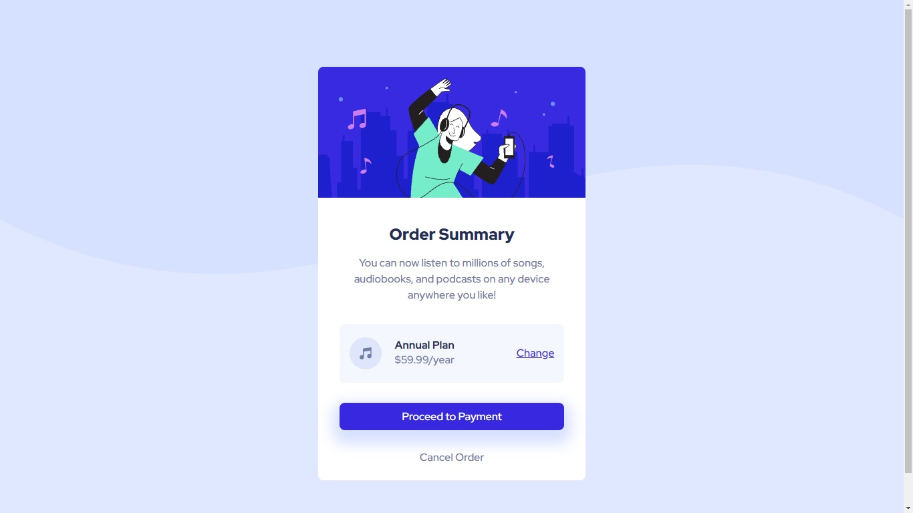

# Frontend Mentor - Order summary card solution

This is a solution to the [Order summary card challenge on Frontend Mentor](https://www.frontendmentor.io/challenges/order-summary-component-QlPmajDUj). Frontend Mentor challenges help you improve your coding skills by building realistic projects.

## Table of contents

- [Overview](#overview)
  - [The challenge](#the-challenge)
  - [Screenshot](#screenshot)
  - [Links](#links)
- [My process](#my-process)
  - [Built with](#built-with)
  - [What I learned](#what-i-learned)
  - [Continued development](#continued-development)
  - [Useful resources](#useful-resources)

## Overview

### The challenge

Users should be able to:

- See hover states for interactive elements

### Screenshot

### Links

Solution URL:()

## My process

1) 
 container for the future card.
2) html tags for images, headings, paragraphs, button, links.
3) link to the css stylesheet.
4) Flex display for the card + column direction.
5) style for the background (image+color+text-align).
6) general style for the card (width, margins for centering, background color,rounded corners, alignment).
7) rounded upper corners of the title-image.
8) link to Google fonts into the body
   font-family, font-size, color properties for the body and headings.
9) 
 container for all data except the title image in order to make margins.
   flex dispay to create a column.
10) nesting flex by creating subscription-container.
    margins + paddings, centering, style (background color, rounded corners.
    positioning inside the container.
11) "change" link - color and hover state.
12) style(including the shadow) and hover state for the button.
13) style and hover state for the "cancel" link.
14) media query for the responsive web design.

### Built with

- Semantic HTML5 markup
- CSS custom properties
- Flexbox
- CSS media queries for responsive web design

### What I learned

I've used CSS Flexbox layout for the first time in my practice.

Also I made the whole button design (including shadow) for the 1st time.

I've learned how to use an image as a background (simultaneously with the background-color, make an image fit the box without repetition).

``
.btn{
background-color: hsl(245, 75%, 52%);
box-shadow: 0 10px 20px 10px hsl(225, 100%, 92%);
color: #fff;
padding: 10px 0;
margin: 15px 0 30px;
border-radius: 8px;
border: none;
font-family: 'Red Hat Display', sans-serif;
font-size: 1rem;
font-weight: 500;
}
.btn:hover{
  background-color: hsl(245, 75%, 75%);
}
``

### Continued development

how to optimize coding the layout (grid? multi-columns?) without using do much flex?

### Useful resources

- [resource 1](https://developer.mozilla.org/en-US/docs/Web/CSS/CSS_Flexible_Box_Layout/Basic_Concepts_of_Flexbox) - I've acquired rudimentary knowledge of Flexbox layout.
- [resource 2](https://developer.mozilla.org/en-US/docs/Learn/CSS/Building_blocks/Backgrounds_and_borders) - about background images.
